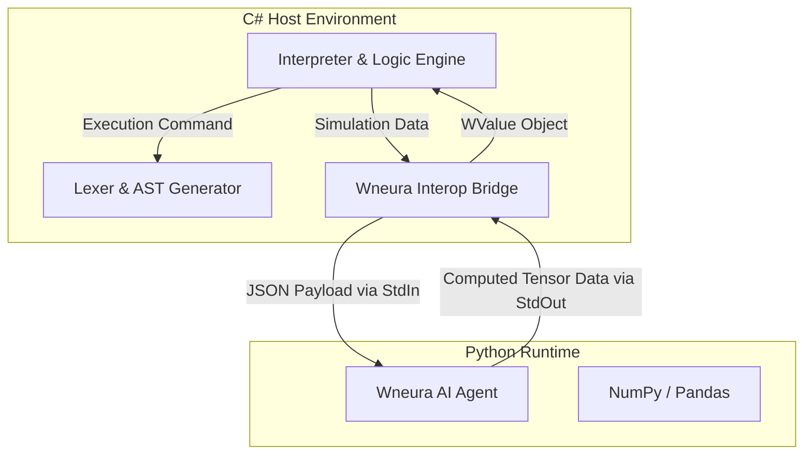

# WSharp (we#) Scientific Simulation Platform

   

**WSharp** is a high-performance, domain-specific language (DSL) designed to bridge the gap between **biological computation (C#)** and **artificial intelligence agents (Python/Wneura)**.

> **Designed for:** Computational Neuroscience, Quantum Simulation, and Hybrid AI Modeling.

---

## 📑 Table of Contents (Hızlı Erişim)
1. [System Architecture](#1-system-architecture)
2. [Core Capabilities](#2-core-capabilities--modules)
3. [Installation](#3-installation--configuration)
4. [Usage Examples](#4-usage-examples)

---

## 1. System Architecture

<details>
<summary>🔻 <b>Click to view Architecture Diagram & Details</b></summary>
<br>

WSharp utilizes a dual-engine architecture. The core runtime is built on **.NET 10.0 (C#)** for memory management, while neural network training is offloaded to a **Python** subprocess via a custom Interop Layer.

### Data Flow & Marshaling
Data exchange uses high-speed JSON serialization.


</details>
2. Core Capabilities & Modules

```
Module        |  Description                                                                                       | Status                                                                                                                     |
NeurologyLib  |  Implements biophysically accurate equations (Nernst, GHK, Hodgkin-Huxley) for                     | Stable
membrane potential simulation.                                                                                     |
              |                                                                                                    |
PythonBridge  |  A headless interop layer managing external Python processes and IPC (Inter-Process Communication).| Stable
              |                                                                                                    |
AIFixer       |  Compile-time heuristic analysis tool that detects syntax errors and suggests self-healing code.   | Active
              |                                                                                                    |
QuantumLib    |  Abstract mathematical structures for quantum superposition and entanglement simulations.          | Active
              |                                                                                                    |
Bio/Chem Libs |  Stoichiometric balancing and radioactive decay simulations.                                       |Active
```

3. Installation & Configuration
<details> <summary>🔻 <b>Click for Setup Instructions</b></summary>

System Prerequisites

OS: Windows 10/11 (x64).

Runtime: .NET 10.0 (Preview/RC).

Python: Python 3.9+ (Packages: numpy, pandas).

Bridge Configuration

To run wea_wneura_run commands, update the PythonPath in src/WSharp/PythonBridge.cs:
```
// Configuration: Absolute path to the Python interpreter
private static string PythonPath = @"C:\Users\Admin\AppData\Local\Programs\Python\Python311\python.exe";
```
</details>
4. Usage Examples
<details> <summary>🔻 <b>Example A: Running a Hybrid AI Simulation</b></summary>

In this scenario, WSharp initializes a neural link and dispatches training tasks to a Python-based agent (Wneura).
```
// 1. Initialize
wea_emit("System Status: Online. Initializing Neural Link...");

// 2. Trigger Wneura Agent (Headless)
// --epochs: Training duration.
wea_unit brain_data = wea_wneura_run("Wneura/agent.py", "--epochs 100 --learning_rate 0.01");

// 3. Process Results
wea_emit("Training Sequence Complete. Final Accuracy Metrics:");
wea_emit(brain_data);
```
</details>

<details> <summary>🔻 <b>Example B: Membrane Potential Calculation</b></summary>
Calculating voltage using the Goldman-Hodgkin-Katz equation.

```
// Parameters: Ion Permeability and Concentrations (mM)
wea_unit vm = wea_neuro_ghk_voltage(
    1.0, 0.04, 0.45,    // Permeability (K, Na, Cl)
    4.0, 140.0,         // Potassium (K)
    145.0, 15.0,        // Sodium (Na)
    110.0, 5.0          // Chloride (Cl)
);

wea_emit("Calculated Membrane Potential (mV):");
wea_emit(vm);
```
</details>

5. Maintenance Cycle

The WSharp project follows a "Continuous Stability" development philosophy.

Code Audits: Weekly reviews for memory leak detection and Big O complexity reduction.

Version Target: Currently in Release Candidate (RC) status.

6. License

This project is licensed under the MIT License.

Lead Developer: Efeatagul/weagw Copyright: © 2026 weagw


