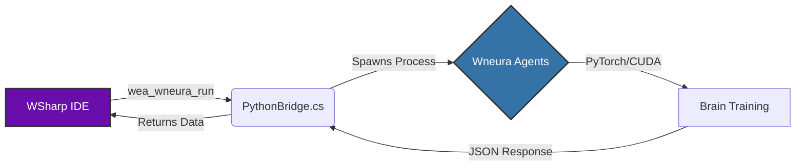

# 🧬 WSharp (we#)
### Scientific Neurology & AI Simulation Platform

**"Simulating the complexity of biological brain development and decision-making processes."**

**WSharp**, biyolojik hesaplama (C#) ile yapay zeka ajanları (Python/Wneura) arasındaki boşluğu dolduran, **Headless Architecture** yapısına sahip yüksek performanslı bir bilimsel simülasyon dilidir.

[Mimari](#-system-architecture) • [Özellikler](#-key-features) • [Kurulum](#-installation) • [Kullanım](#-usage-examples)

---

## 🧠 System Architecture (The Hybrid Core)

WSharp, C#'ın hızını Python ekosisteminin esnekliğiyle birleştiren hibrit bir yapı kullanır. Aşağıdaki şema sistemin nasıl konuştuğunu gösterir:

Özellik            Açıklama                                                                       Durum
 NeurologyLib,     Nernst, GHK ve Hodgkin-Huxley denklemleri için yerleşik fonksiyonlar           Aktif
 PythonBridge,     WSharp içinden harici Python (Wneura) scriptlerini ""Headless"" çalıştırma.    Yeni
 AIFixer           Otomatik sözdizimi hatası tespiti ve kendi kendini onaran kod önerileri        Beta
 QuantumLib,       Temel kuantum süperpozisyon ve dolanıklık simülasyonları.,                     Deneysel
 Bio/Chem Libs     Kimyasal reaksiyonlar ve biyolojik bozunma simülasyonları.,                    Aktif

Installation & Setup
Gereksinimler (Prerequisites)
OS: Windows 10/11

Runtime: .NET 10.0 (Preview/RC)
Python: Python 3.9+ (Wneura entegrasyonu için şart)
Yapılandırma (Python Bağlantısı)
wea_wneura_run komutlarını kullanmak için köprüyü yapılandırmalısınız:
WSharp/PythonBridge.cs dosyasını açın.
PythonPath değişkenini bulun.
Python yolunuzu yapıştırın (veya otomatik algılama için dokunmayın).

private static string PythonPath = @"PASTE_YOUR_PYTHON_PATH_HERE";

Usage Examples
1. Wneura Ajanı Çalıştırma (Python Entegrasyonu)
WSharp, bir Python AI ajanını tetikler, eğitilmesini bekler ve veriyi geri alır.

// Simülasyonu Başlat
wea_emit("Initializing Neural Link...")

// Wneura klasöründeki ajanı çalıştır
// Argümanlar: script_yolu, parametreler
wea_unit brain_data = wea_wneura_run("Wneura/agent.py", "--epochs 100")

// Python beyninden gelen JSON sonucunu ekrana bas
wea_emit("Training Complete. Results:")
wea_emit(brain_data)

2. Biyolojik Hesaplama (NeurologyLib)
Goldman-Hodgkin-Katz (GHK) denklemi ile membran potansiyeli hesaplama.

// Parametreler: Geçirgenlik ve Konsantrasyonlar (K, Na, Cl)
wea_unit vm = wea_neuro_ghk_voltage(
    1.0, 0.04, 0.45,  // Permeability (Pk, Pna, Pcl)
    4.0, 140.0,       // K (out, in)
    145.0, 15.0,      // Na (out, in)
    110.0, 5.0        // Cl (out, in)
)

wea_emit("Membrane Potential (mV):")
wea_emit(vm)

Roadmap & Development Routine
Geliştirme süreci katı bir disiplinle ilerler.

Rutin: Her Pazar, haftalık hata düzeltmeleri, optimizasyon ve kod incelemeleri yapılır.

Sonraki Adımlar:

[ ] Scientific Plotter ile Python verilerinin canlı çizimi.
[ ] ML tabanlı hata tahmini sunan gelişmiş AIFixer.
[ ] Bozunma simülasyonları için NuclearLib genişletmesi.

 MIT License by <b>Efeatagul/weagw</b> 

